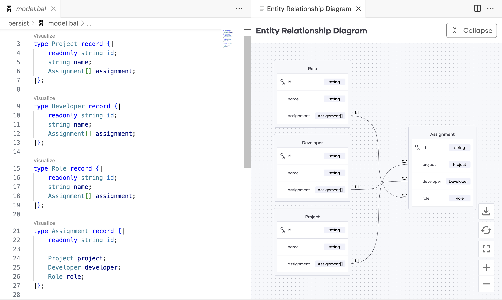

## Ternary Relationships with Bal persist
This repository contains sample data model to demonstrate how to persist ternary relationships with Bal persist. Take a look at the data model [here](./persist/model.bal).

